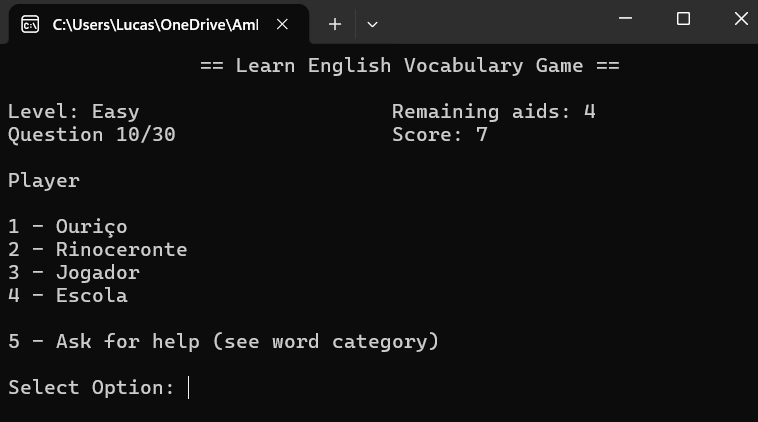

# Vocabulary Game 2

A C# console application that helps users practice English vocabulary through multiple-choice questions.

## Features

- Multiple difficulty levels
- Word categories
- Hint system
- Randomized questions
- Score tracking

## Concepts Used

- Enums
- Records
- Collections
- LINQ
- Methods
- Input validation
- Randomization

## Technologies

- C#
- .NET Console Application